# WARDOGS Autopilot


Captures the in-game minimap, localizes the vehicle on the full map with an offline
SIFT feature index, and drives the truck by injecting WASD/Space keystrokes through
an Arduino Micro that emulates a USB HID keyboard.

## How it works

```mermaid
%%{init: {
  'theme': 'base',
  'flowchart': { 'curve': 'basis', 'nodeSpacing': 45, 'rankSpacing': 65, 'wrap': true },
  'themeVariables': {
    'fontSize': '14px',
    'primaryColor': '#37474F',
    'primaryTextColor': '#ffffff',
    'primaryBorderColor': '#78909C',
    'lineColor': '#90A4AE',
    'secondaryColor': '#37474F',
    'tertiaryColor': '#37474F'
  }
}}%%
flowchart LR
    subgraph Game["Game Machine"]
        direction TB
        Screen(["Game Window"])
        Minimap[/"Minimap Region"/]
        Capture["Screen Capture<br/>mss"]

        Screen -->|ROI crop| Minimap
        Minimap -->|Grab frame| Capture
    end

    subgraph Autopilot["Autopilot Application"]
        direction TB
        Locator["SIFT Matcher<br/>FeatureIndex"]
        Tracker["Position Tracker<br/>LiveLocator thread"]
        Nav["Navigation<br/>FollowDriver"]
        UI["Studio GUI<br/>PySide6"]

        Locator -->|Pose + heading| Tracker
        Tracker -->|Position stream| Nav
        Tracker -->|Position stream| UI
        Nav -->|Key mask| UI
    end

    subgraph HW["Hardware"]
        direction TB
        Arduino["Arduino Micro<br/>ATmega32U4"]
        Keys(["USB HID<br/>WASD + Space"])

        Arduino -->|Emulated keypresses| Keys
    end

    Capture -->|Grayscale frame| Locator
    Nav -->|Serial byte mask| Arduino
    Keys -->|Input injection| Screen

    classDef core fill:#1565C0,stroke:#90CAF9,stroke-width:1.5px,color:#ffffff
    classDef app fill:#2E7D32,stroke:#A5D6A7,stroke-width:1.5px,color:#ffffff
    classDef hw fill:#AD1457,stroke:#F48FB1,stroke-width:1.5px,color:#ffffff

    class Screen,Minimap,Capture core
    class Locator,Tracker,Nav,UI app
    class Arduino,Keys hw

    style Game fill:none,stroke:#78909C,stroke-width:1px,color:#90A4AE
    style Autopilot fill:none,stroke:#78909C,stroke-width:1px,color:#90A4AE
    style HW fill:none,stroke:#78909C,stroke-width:1px,color:#90A4AE
```



- **Localization** matches minimap SIFT descriptors against a per-map tile index
  (three pyramid levels; radius search around the previous pose, global fallback,
  multi-frame vote gate against jump re-acquisitions).
- **Navigation** follows a waypoint route: pure-pursuit bearing with two corridors,
  pulse/hold steering, a corner-speed planner based on the vehicle model, and a
  final waypoint stop that trusts the speedometer OCR over the position estimate.
- **Input** is a single serial byte per tick (key mask). The firmware releases all
  keys if no valid byte arrives for 200 ms.
- **Studio (PySide6)**: minimap ROI calibration, live capture diagnostics, the map
  with the route editor, locator/vehicle/corridor tuning (applies live), map cache
  and SIFT index management, and manual-driving recording.

## Requirements

- Windows, Python 3.11+ (3.13 pinned in `.python-version`), [uv](https://docs.astral.sh/uv/)
- Arduino Micro / Pro Micro (ATmega32U4) on the default port `COM6`
  (the studio still localizes and previews without it)

---

## Setup

```bash
uv sync                     # runtime + dev dependencies
uv run python tools/download_map.py --list
uv run python tools/download_map.py zestafona   # derived artifacts (index + caches)
uv run python tools/download_map.py --all --verify
uv run python main.py ui    # or autopilot.bat (windowless pythonw)
```

Map assets are distributed as derived artifacts only (`<map>_feat.npz`,
`<map>_mu.npy`, the `<map>_preview_*.npy` pyramid and `<map>_gray.txt`), listed
with sizes and sha256 in `data/maps/catalog.json`; the original map PNG is not
distributed. Rebuilding the caches from the source PNG is a maintainer flow:

```bash
uv run python tools/build_map_assets.py --all --rebuild --export dist-assets
```

If the feature index is missing, the locator reports `no_index`; download it
with `tools/download_map.py <map>` (maintainers can rebuild it with
`uv run python -m autopilot.vision.featureindex --build zestafona`).

### Arduino firmware

FQBN `arduino:avr:micro`, sketch `arduino/keyboard_emulator/keyboard_emulator.ino`.
`arduino-cli` is not on PATH (bundled with the Arduino IDE), and the `Keyboard`
library lives outside the AVR core, so it must be passed at compile time:

```powershell
$cli = "C:\Program Files\Arduino IDE\resources\app\lib\backend\resources\arduino-cli.exe"
$libs = "$env:LOCALAPPDATA\Arduino15\libraries"
$build = "$env:TEMP\kb_build"
& $cli compile --fqbn arduino:avr:micro --libraries $libs --build-path $build arduino\keyboard_emulator
& $cli upload -p COM6 --fqbn arduino:avr:micro --input-dir $build arduino\keyboard_emulator
```

## Configuration

`config.json` (validated by the Pydantic schema in `src/autopilot/common/config.py`)
holds capture (`monitor`, `mmap_roi`, `speed_roi`), map, locator, navigator and UI
settings. Most navigator/locator values can be tuned live in Map → `⚙ Tuning`;
changes are written back to `config.json`.

## Hotkeys

| Key | Action |
| --- | --- |
| F6 | start / pause follow |
| F7 | emergency stop (release all keys) |
| F8 | reverse the route direction |

Registration is retried while another process holds the keys, and the studio
toolbar shows their state.

## Routes, presets and teach-and-repeat

- Map → `New` creates an empty preset; `✏ Edit` enables point editing and is
  replaced by `✓ Apply` / `✕ Cancel` (`Apply` saves into the selected preset).
- The last used preset is loaded on startup; window geometry is remembered.
- Map → `⏺ Record my driving` logs your own keys + poses to
  `output/manual_dbg_*.jsonl`; convert a recording into a route preset with
  `uv run python tools/route_from_manual.py output/manual_dbg_*.jsonl --map zestafona --name my_route`.

## Arduino protocol

One byte per command over USB serial (115200 baud):

| Bit | Key |
| --- | --- |
| 0x01 | W (throttle) |
| 0x02 | A (steer left) |
| 0x04 | S (brake / reverse) |
| 0x08 | D (steer right) |
| 0x10 | SPACE |

`0xFF` releases all keys; bytes with bits above `0x1F` are treated as garbage.
The firmware has a 200 ms watchdog.

---

## Tools

| Tool | Purpose |
| --- | --- |
| `tools/download_map.py` | fetch the derived map artifacts from GitHub Releases (`--verify` checks sha256) |
| `tools/build_map_assets.py` | refresh `catalog.json` from the artifacts; `--rebuild` regenerates caches from the source PNG (maintainer) |
| `python -m autopilot.vision.featureindex` | build the SIFT index (`--build <map>`) |
| `tools/selfcheck_features.py` | offline localization regression |
| `tools/nav_dbg.py` | navigation trace inspector (`--tail`, `--bursts`) |
| `tools/calibrate_vehicle.py` | fit `yaw_gain` / `brake_g` from nav logs |
| `tools/route_from_manual.py` | convert a manual-driving recording into a preset |
| `tools/map_match_debug.py` | frame matching collage for failed matches |
| `tools/replay_fails.py` | replay saved failed frames |
| `tools/regray_map.py`, `tools/build_hud_atlas.py`, `tools/extract_vehicle_profile.py` | asset/profile build helpers |

## Layout

```text
wardogs-autopilot/
├── main.py                     # CLI & GUI entry point
├── config.json                 # validated runtime configuration
├── autopilot.bat               # windowless launcher (pythonw)
├── arduino/
│   └── keyboard_emulator/      # ATmega32U4 firmware (byte mask → HID WASD/Space)
├── data/
│   ├── maps/                   # derived artifacts: SIFT index, mu, preview pyramid, catalog
│   ├── masks/                  # minimap static mask (mm_mask.png)
│   ├── hud/                    # digit atlas + font for the speed OCR
│   ├── presets/<map>/          # waypoint route presets
│   └── vehicles/               # vehicle physics profiles (ural.json)
├── src/autopilot/
│   ├── common/                 # typed config, logging, crash logging
│   ├── hardware/               # screen capture (mss), Arduino key driver
│   ├── navigation/             # follow driver, path/speed/steering controllers, telemetry
│   ├── ui/                     # PySide6 studio, map view, tabs, presets, manual recorder
│   └── vision/                 # map store, feature index, locator, tracker, speed OCR
├── docs/                       # minimap visuals, vehicle model and tuning runbook
├── tests/                      # unit and regression tests
├── tools/                      # developer CLI utilities
└── output/                     # logs, nav traces, debug dumps (git-ignored)
```

## Development

```bash
uv run pytest          # unit and regression tests
uv run ruff check .    # lint
uv run mypy            # types
```

---

## License

MIT — see [LICENSE](LICENSE).
